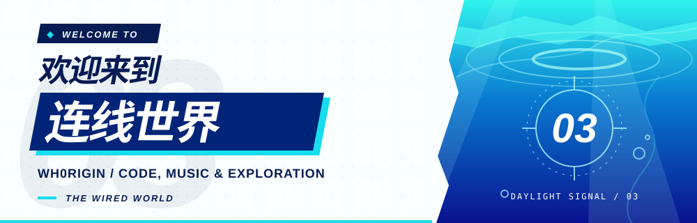

  <a href="https://wh0rigin.github.io/"><picture><source media="(prefers-color-scheme: dark)" srcset="img/readme/header-dark.svg" /></picture></a>

  <a href="https://wh0rigin.github.io/"><picture><source media="(prefers-color-scheme: dark)" srcset="img/readme/nav-home-dark.svg" /></picture></a>
  <a href="https://wh0rigin.github.io/blog/"><picture><source media="(prefers-color-scheme: dark)" srcset="img/readme/nav-blog-dark.svg" /></picture></a>
  <a href="https://github.com/Wh0rigin?tab=repositories"><picture><source media="(prefers-color-scheme: dark)" srcset="img/readme/nav-projects-dark.svg" /></picture></a>
  <a href="mailto:polyfun@foxmail.com"><picture><source media="(prefers-color-scheme: dark)" srcset="img/readme/nav-contact-dark.svg" /></picture></a>

   <b>Wh0rigin</b> · Developer · CS (B.E.) &amp; AI (M.E.) student · IoT background

## 01 / About me

- 💻 Interested in software development, with a current focus on **AI agents** and middleware internals.
- 🌱 Learning **Rust** and **CMake**.
- ✍️ Sharing notes on code, music, and everyday life.

More about my background & interests

- Participated in IoT, intelligent car, and maker competitions.
- Student member of CCF (China Computer Federation) and CAAI (Chinese Association for Artificial Intelligence).
- Enjoy animation, video editing, and creative tools such as Photoshop, Premiere Pro, Blender, and Cinema 4D.

## 02 / Tech stack

    

- **Backend & infrastructure:** Spring, MySQL, MongoDB, Redis, Nginx, RabbitMQ, Kafka, Elasticsearch, Kibana.
- **Development tools:** Git, Docker, Linux, Bash, PowerShell, Vim, VS Code, Visual Studio.
- **Web & mobile:** JavaScript, HTML, CSS, Android Studio.
- **Embedded & IoT:** STM32, Zigbee / CC2530, Arduino, Altium Designer.

## 03 / Find me elsewhere

[Zhihu](https://www.zhihu.com/people/guang-jiu-48-93) · [CSDN](https://blog.csdn.net/qq_33985931) · [LeetCode](https://leetcode.cn/u/wh0rigin/)

GitHub activity

  

  <b>04 / VISITORS</b> · Thanks for connecting. 
  

  <a href="README.minimal.md">Minimal edition</a> · <a href="README.styled.md">Wired edition</a> · <a href="docs/readme-versions.md">切换版本</a>

